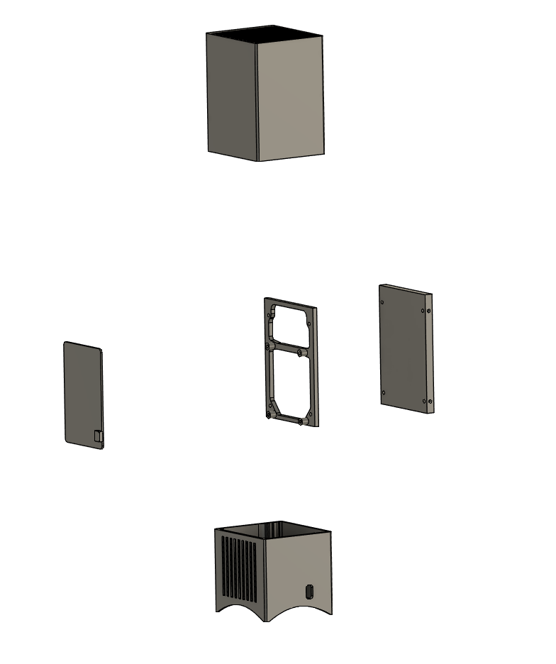
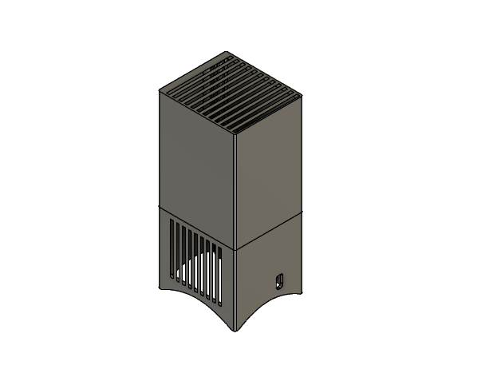
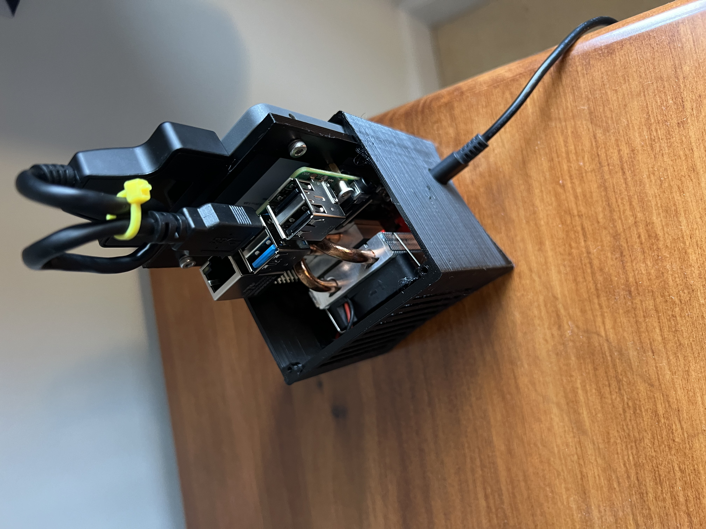
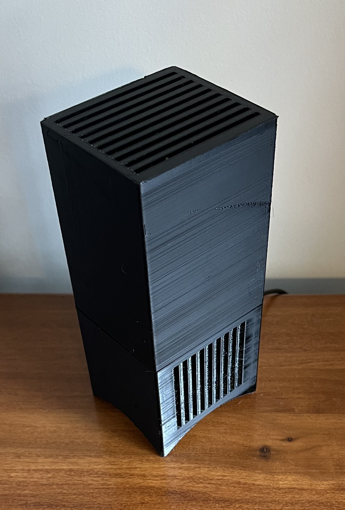

## This is a housing design for a raspberry pi 4.

   
## Images:

   

   

   

## BOM:
| item_id | Source | Item |
|-------|------|----|
|A|Puchased| raspberry pi 4(or same form factor single board computer(sbc)) |
|B|Puchased| [pi4 heatsink+fan kit](https://www.amazon.com/gp/product/B07ZV1LLWK/ref=ppx_yo_dt_b_asin_title_o00_s00?ie=UTF8&th=1)|
|C|Puchased| 4 x M2.5 screws, the above fan/heatsink kit provides these, otherwise purchased required|
|D|Puchased| 4 x M3 x 6mm hex key screws.|
|E|Puchased| 1 x Solid State Drive(SSD), 2.5inch form factor.|
|F|Puchased| [1 x Sata to USB3 cable](https://www.amazon.com/gp/product/B01ESJS36Q/ref=ppx_yo_dt_b_search_asin_title?ie=UTF8&psc=1)|
|G|Puchased| 1 x zip tie|
|H|Printed| |
|I|Printed| ||
|J|Printed| ||

## Assembly:
1. (optional)Print calibration cube or other calibation print and test dimensional accuracy. The tolerances are tight and you will want to ensure your settings are dialed in.
2. Print all 3d printed parts(H,I,J. PETG and PC Blends recommended). Current configuration will probably be about 10 hrs of print time.
3. Using 4x M3  x 6mm screws(D), screw ssd to pi_ssd_mount.stl.
4. Using 4x M2.5 screws(C), screw pi4 board to the opposite side of pi_ssd_mount.stl
5. Attach Sata cable(F) to both SSD and to pi USB3 slot.
6. Using zip tie(G) roll up and zip tie the cable to shorten its protrusion.
7. Slide pi4/ssd assembly into exterior_bottom.stl(I).
8. Slide exterior_top.stl(H) onto the rail created by pi_ssd_mount.stl.
9. Plug USB-C power cable into the rear of unit.

---
## Software:
There are many options here, but for simplicity, the raspberry pi headless OS lite is a good start.
Proceed with formating/writing the drive with raspberry pi imager, setting wifi password, hostname, etc.You many need to first boot with microsd, in order to change the boot order.
Access via ssh terminal(putty and other options)
Proceed with the packages of your choice. 

Step and STL models are provided, permission of course to edit based on your needs. 
